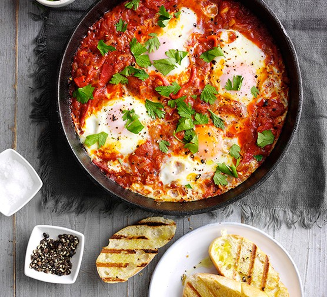
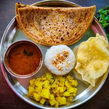
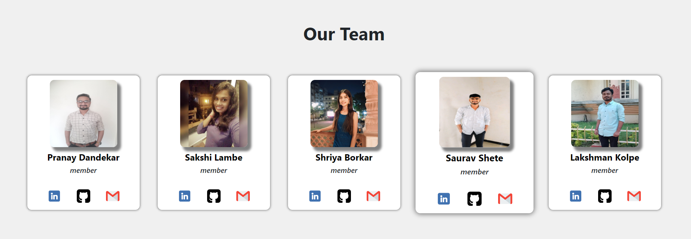

# Dish Delight

A simple recipe management system built with React.
This project is a simple recipe management system where users can read & and make special dishes to make holidays beautiful.

### Varieties

## Maharashtrian Special
### Puran Poli

## Team Members

