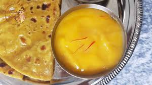

# Dish Delight

A simple recipe management system built with React.
This project is a simple recipe management system where users can read & and make special dishes to make holidays beautiful.

<table>
  <tr>
    <td></td>
    <td></td>
    <td></td>
  </tr>
</table>

### Varieties

## Maharashtrian Special
### Puran Poli

<table>
<tr>
<td>

</td>

## Team Members

